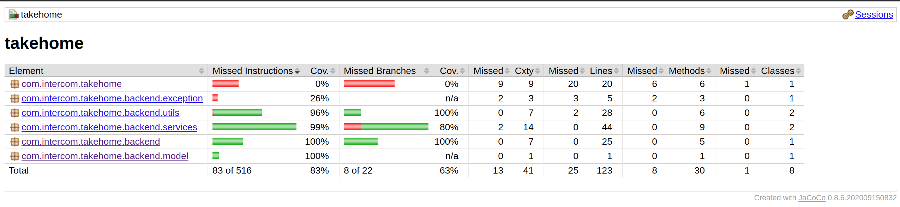

## Invitation microservice
The Invitation Micro service reads in customer records from a text file (customers.txt) and produces an output file (output.txt). 
The output file contains a list of names and userIds of customers who are within a given distance (100Km) from a given location (Intercom's Dublin Office).


The given distance, and latitude and longitude of the given location are stored in the application.properties file, as seen below.
````
dublin.office.location.longitude=-6.257664
dublin.office.location.latitude=53.339428
dublin.office.invitation.range=100
````
This values can be altered before running the application locally if desired. 

In order to run this locally we need to provide a customer records txt file in the following folder src/main/resources/
The file name is currently set to customer.txt in the application.properties. see below. 
```
customer.records.file.name=customers.txt
````
---
##Local Deployments


####Execute the following commands to run the application locally

1 Clone the git repo. execute the following command 
```shell script
git clone https://github.com/colgandm/solid-happiness.git
```
2 Navigate to the solid-happiness directory. 
```shell script
cd solid-happiness/
```
3 Run Mvn clean install to install and package the applicaiton
```shell script
mvn clean install
```
4 Run the application by executing the following command.
```shell script
mvn spring-boot:run -Dspring-boot.run.arguments="file"
```
This will run the application, reading in customer records from a text file **customers.txt** found at **src/main/resources/** and creating an **output.txt** file.

Alternatively you can pass in a command line arg "s3" to retrieve the file from the s3 bucket specified in the **application.properties** This too will create an output.txt file.
```shell script
mvn spring-boot:run -Dspring-boot.run.arguments="s3"
```
5
Once ran the output.txt file will be located in the root directory.
```
userId=4, name='Ian Kehoe'
userId=5, name='Nora Dempsey'
userId=6, name='Theresa Enright'
userId=8, name='Eoin Ahearn'
userId=11, name='Richard Finnegan'
userId=12, name='Christina McArdle'
userId=13, name='Olive Ahearn'
userId=15, name='Michael Ahearn'
userId=17, name='Patricia Cahill'
userId=23, name='Eoin Gallagher'
userId=24, name='Rose Enright'
userId=26, name='Stephen McArdle'
userId=29, name='Oliver Ahearn'
userId=30, name='Nick Enright'
userId=31, name='Alan Behan'
userId=39, name='Lisa Ahearn'
```
---

####Running Unit Tests
From the solid-happiness directory executing Mvn clean install will run the unit tests located under src/test/java
```shell script
mvn clean install
```
This will generate Jacoco code coverage reports. Navigate to **/target/site/jacoco/com.intercom.takehome/** and open the index.html file in a web browser to view and browse code coverage.

